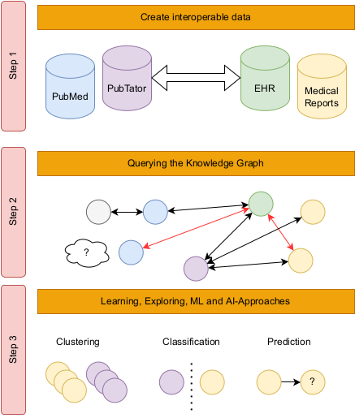
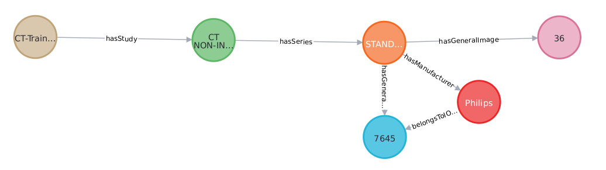

# Documentation



A software package to create interoperable clinical data in a knowledge graph.

## Background

Knowledge graphs have been shown to play an important role in recent knowledge mining settings, and contextual information is widely used for NLP and knowledge discovery tasks. We combine all these methods to present a generic approach for linking data from different data sources, e.g. PubMed, medical and clinical data and documents.


## Importer

The idea of the importer lies in the generic transferability to other data and a user-specific view and configuration. Depending on the given context and existing data, it should be possible to work with individual data and graphs. For this reason, the importer is preceded by a config file. This is an ini file, in which can be specified after given scheme, which nodes are desired by the user and which attributes and relations they should have. Any additional information contained in the data is then not taken into account during the import. See also [[https://github.com/TbsHbnthl/master-s-thesis-link-prediction-on-large-scale-knowledge-graphs]] for further data and information.

Within the config file the desired nodes are declared as sections in square brackets. Under it the following key-value pairs are stored in each case, whereby for the present work exemplarily with a self-selected configuration one works:



* relationsto: Here all sections of the node types are specified, to which the nodes of the given section in the graph to be created should have edges.
* relationtypes: Under this key all relation types are specified. The i-th relation type correlates with the edge to the i-th node specified in the line above. The naming of the relations is based on the Dublin Core standard.
* attributes: All attributes that the currently considered node should have are listed here. The special naming follows the specifications of the DICOM standard.
* class: The node class is stored here. This is defined by the DICOM standard. This includes for example IOD modules or attributes. 
* usage: The usage of an IOD module. This input is used to connect the nodes that belong to the IOD module class to the corresponding usage node.
* uid: Here is stored what should be used as unique identifier for the node. For patients, for example, the PatientID is used for this.
* uidfromds: This is a boolean value that specifies whether the value stored in uid should be used directly as the unique identifier, as is the case with General Image, for example, or should be taken from the file read in Python. 
* sequenceboolean: Due to the described tree structure of the header parts of the DICOM files, information is partially nested in a sequence. To read out the data, it is stored here for a node whether such a sequence must be considered.
* sequence: If the boolean value for sequenceboolean is 1, this specifies under which branch of the tree the information is found. Another possibility would be an additional search in the importer. 
* date: Each DICOM file may contain several dates in its header data which belong to different sections, e.g. the date of a study or an image. If a date stamp is provided for the corresponding section (or for the corresponding node), it is specified here, separated by a comma, under which attribute of the imported DICOM file the corresponding date can be found and which edge type is provided for it. This is relevant, among other things, because a patient has a date of birth, but a study has a StudyDate. If no date is to be used for the node, it can be left empty.
* time: Analogous to the date, a value for a time is optionally stored here. Otherwise it is also left empty.


```
[Patient]
relationsto = General_Study,Usage,Patient_Age,Patient_Weight
relationtypes = hasStudy,is,hasAge,hasWeight
attributes = PatientName,PatientIdentityRemoved,DeidentificationMethod
class = IOD Module
usage = M
uid = PatientID
uidfromds = 1
sequenceboolean = 0
sequence =
date = PatientBirthDate,hasBirthDate
time =
```

### Data Schema

See Dörpinghaus, Jens, et al. "A novel link prediction approach on clinical knowledge graphs utilizing graph structures." 17th Conference on Computer Science and Intelligence Systems (FedCSIS). IEEE, 2022.

### Process

For details on the process itself we refer to: https://github.com/TbsHbnthl/master-s-thesis-link-prediction-on-large-scale-knowledge-graphs/blob/main/PDF/Masterarbeit%20Tobias%20H%C3%BCbenthal%205640520.pdf

### Import to Neo4j

The data is imported using the Admin import tool (see [60]) of Neo4j. This can only be done for a previously empty database and is only used for the initial loading of the data into the database. The procedure is suitable for very large data sets. For this, Neo4j Community Server version 4.3.2 is first downloaded from the Neo4j Download Center [61]. Then, two different CSV files are needed to import each node and relation according to the instructions in [60]. The first one contains the actual data and the second one represents the header file. The latter contains the column headers for the former.

These CSV files have already been created by the importer. They are stored under the directory $NEO4J_HOME/import. Here $NEO4J_HOME denotes the local folder where the Neo4j server is located. The console is then used to navigate to the corresponding directory and enter the import command. This follows the pattern is stored at https://github.com/TbsHbnthl/ master-s-thesis-link-prediction-on-large-scale-knowledge-graphs/tree/ main/Neo4j_ready for the data used here.

The functions considered here are concrete. ρ assigns a pair of nodes to each edge. This is reflected in the CSV files. 

```
: START_ID, : END_ID,type,provenance,relationUID
LUNGx−CT025,064Y,hasAge,LUNGx−CT0251 −013. dcm,LUNGx−CT025hasAge064YLUNGx−CT0251 −013. dcm
```
This shows an at play composite of the header file hasAge_header.csv and a section of the associated CSV file hasAge.csv of the edge hasAge. The nodes located at :START_ID and :END_ID in the file are the two nodes assigned to the edge by ρ.

# Cite

If you use this software, please cite the following publications:
* Dörpinghaus, Jens, et al. "A novel link prediction approach on clinical knowledge graphs utilizing graph structures." 17th Conference on Computer Science and Intelligence Systems (FedCSIS). IEEE, 2022.
* Dörpinghaus, Jens, et al. "An efficient approach towards the generation and analysis of interoperable clinical data in a knowledge graph." 16th Conference on Computer Science and Intelligence Systems (FedCSIS). IEEE, 2021.
